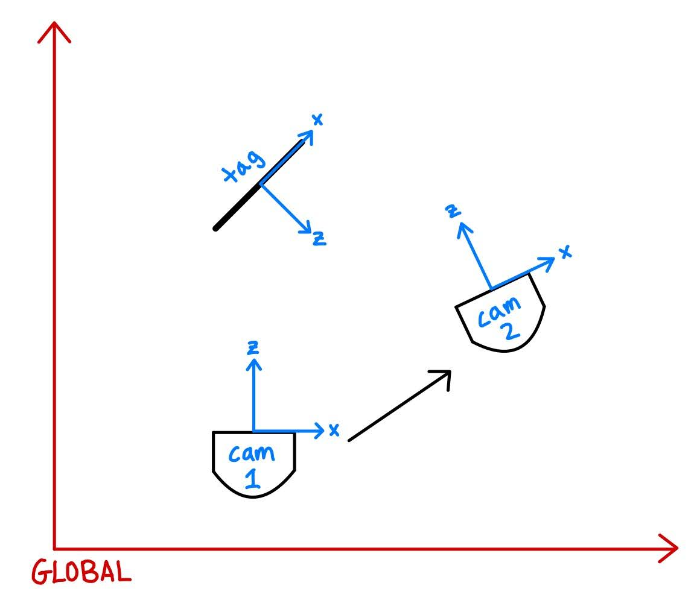

# Visual Odometry
**Charlie Babe, Allison Li, and Jeremy Wenger**

**CompRobo 2022**

Install and run instructions are at the bottom of this document.

## Overview
The visual odometry project is a package that can detect and visualize AprilTags, as well as track the relative movement of a Neato robot based on the changing position relative to the camera of an AprilTag.

Our goals for this project were:
* Gain a deeper understanding of how ROS2 infrastructure works more specifically how to publish and subscribe to topics we create like the camera calibration topic. Also build a deeper understanding of commonly used ROS2 packages like TF2.
* Calibrate a Raspberry Pi camera to be able to get pose information from ApirlTags.
* Be able to localize globally using ApirlTags and compare pose given by the ApirlTags with the wheel odometry from the Neato

## Components
### Camera Calibration
We calibrated our camera using the Nav2 library for ROS2. We used a standard size grid to obtain parameters to adjust for the distortion, focal length, and other intrinsics of the camera.

### AprilTag Visualizer

The AprilTag Visualizer was one of our primary system for troubleshooting our detection system. It allowed for us to recognize how the camera system was behaving and if it were having any issues such as a lack of connection or a decrease in bit rate. The Visualizer recognizes apriltags in the 36h11 family of tags and displays their ID number as well as the distance the tag is away from the camera. It also displays a bounding box around the tag to show that we are able to recognize the corners of each tag and track their movements.

### Relative Movement Tracking

The AprilTag ROS2 node publishes transformations from the AptilTag frame to the camera frame. Given two of these transforms at two different times, the tag_movement_tracker node calculates the relative movement of the Neato in this time interval. It also calculates the relative movement of the Neato based on wheel odometry data. It then plots these two quantities against each other to visualize the accuracy of the AprilTag detections as well as drift in the odometry data. A diagram of the relative positioning is below.

## Code Design Decisions
A design decision we made was to use the class TFhelper which contained helper functions utilizing the TF2 library we used in previous projects. Originally we tried to parse the data from TF topic manually using string recognition to find Apirltag pose information, this proved unreliable so we switched to implementing the TFhelper class which automatically parsed the TF topic using the TF2 Library. We then could easily use the ApirlTag transforms provided by the TF topic to localize. By switching to use the TFhelper class we reduced the amount of code and complexity we needed to implement and instead relied upon preexist open source library TF2.

## Challenges
We encountered some challenges in the process of writing this package.
* ROS2 documentation for working with AprilTags is sparse at the time of writing this package.
* CameraInfo (the camera intrinsics) needed to be published with every frame coming from the Neato camera. To account for this, we wrote a custom launch file to startup the Neato, publish the /camera_info topic, launch the AprilTag ROS2 node, and launch our visualizer for debugging.
* The first detection of an AprilTag and the first wheel odometry data does not necessarily occur on startup of the Neato. Also, sometimes one or the other would have dropped data (usually AprilTag dropping a detection). We made sure to be thorough with handling None values.

## Next Steps
Our next steps are:
* Implement functionality to track relative movement with more than one AprilTag
* Combine odometry and AprilTag data to create a more accurate model of the robot’s movement
* Implement optical flow to track the movement of the Neato without fiducial markers

## Takeaways
We had several takeaways from this project that can be used to benefit future projects including:
* Checking and visualizing software regularly is more efficient than writing everything at once and trying to debug. 
* Camera calibration can be difficult, but worthwhile to get accurate image information like an ApirlTag pose.
* After data gets to a certain size printing all the data is not always useful and visualizations necessary to interpret if the data is correct.
* Using preexisting libraries is much easier and constant then trying to write your own.

## Install
Clone and build this repository.

Clone [the apriltag repository](https://github.com/AprilRobotics/apriltag) and follow the install instructions listed in the README.

Follow the instructions in [this guide for detecting April tags in ROS2](https://nxp.gitbook.io/8mmnavq/navq-developer-guide/software-support/installing-ros2-foxy/detecting-apriltags-with-ros2) through the "Building the apriltag_ros Node" step. **Do not** modify the `CMakeLists.txt` file. Follow the directions in the Nav2 documentation for camera callibration.

## Run
This package currently supports AprilTag family 36h11.
Startup the Neato node and the AprilTag visualizer node by running the bringup.py launch file in this package.

`ros2 launch visual_odometry bringup.py host:=IP_ADDRESS_OF_NEATO`

This will connect to the Neato and launch the visualizer window.

The AprilTag movement tracker node can be launched with:

`ros2 run visual_odometry tag_movement_tracker`

This will begin plotting points based on the Neato's position relative to AprilTag 36h11 #1 as well as the Neato's relative odometry position, with the origin at the initial position of the Neato upon starting the movement tracker node.

## Demos
